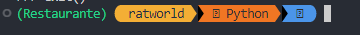

# Trabajo Final del Curso

El restaurante Punto Azul necesita mejorar la gestión, para esto se ha decidido sistematizar 
el proceso de facturación utilizando el lenguaje de programación de Python. El sistema debe 
tener un menú principal de 3 categorías desayuno, almuerzo, cena. Cada categoría debe 
tener submenús que permita elegir el Ítem deseado. Cuando finalice la compra el cliente, 
debe generar una boleta de ventas donde debe mostrar subtotal, IGV y total a pagar.

## Requerimientos

- Python 3.10.6 (Se recomienda usar un administrador de entornos como `venv`)

## Instrucciones para configurar el entorno de desarrollo

1. Clona este repositorio en tu máquina local, o puedes descargar el .zip file sin problemas:

´git clone <https://github.com/Eliot-Arias/RestaurantPythonProject>´

2. Ve al directorio del proyecto:

´cd nombre-del-proyecto´

3. Crea un entorno virtual para el proyecto. Puedes hacerlo de la siguiente manera:

´python -m venv Restaunte´

4. Se creara una serie de archivos, para poder inicializar el entorno virtual y poder ejecutar el proyecto, sigue este paso:

´ source .\Restaurante\Scripts\activate´

- "TrabajoFinal" es el nombre del proyecto, pero puedes cambiar el nombre, si es que creaste el proyecto con un nombre diferente.

5. Si el comando funciono debera aparecerte el nombre del proyecto entre parentesis en la consola, tal y como se muestra en la imagen:

[]

6. Acontinuación se descargaran algunas de las dependencias del proyecto:

- primero se actualiza ´pip´: ´python.exe -m pip install --upgrade pip´

- despues se instala la dependencia: pip install prettytable

7. Ejecutar el proyecto.

